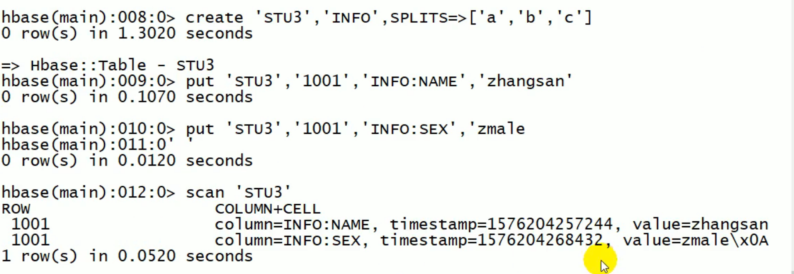
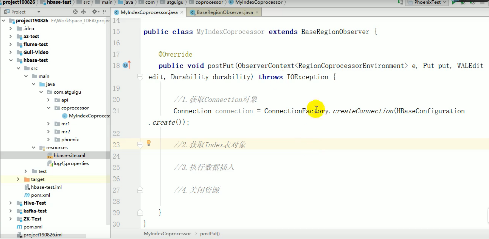
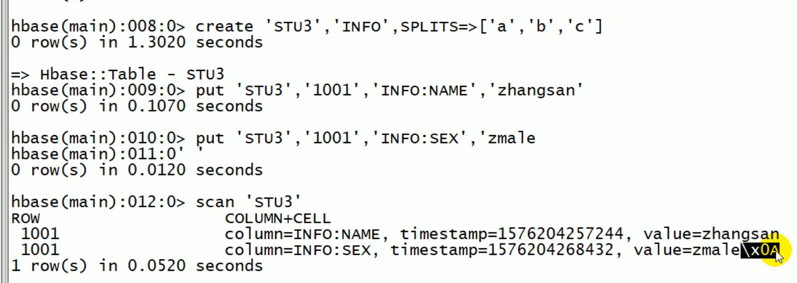

# Phoenix简介

## 1.1 Phoenix定义

Phoenix是HBase的开源SQL皮肤。可以使用标准JDBC API代替HBase客户端API来创建表，插入数据和查询HBase数据。

## 1.2 Phoenix特点

1) 容易集成：如Spark，Hive，Pig，Flume和Map Reduce。

2) 性能好：直接使用HBase API以及协处理器和自定义过滤器，可以为小型查询提供毫秒级的[性能](http://phoenix.apache.org/performance.html)，或者为数千万行提供数秒的性能。

3) 操作简单：DML命令以及通过DDL命令创建表和版本化增量更改。

4) 安全功能: [支持GRANT和REVOKE](https://issues.apache.org/jira/browse/PHOENIX-672) 。

5) 完美支持Hbase二级索引创建。

## Phoenix和Hive的区别

Hive是HDFS的SQL层
Phoenix是HBase的SQL层

对象不一样
使用场景区分很明显

Hive感觉更适合离线资料分析
并且无效能要求那种

Phoenix由于是搭载HBase上
所以比较适合一些real time的
当然对离线资料也是可以的

## Pheonix操作

## shell操作

### 表的操作

put ,insert,update,delete,create,select之类的,用到再查 


**Hbase对表的操作**




**Phoenix对表的操作**


### 表的映射

当hbase中不存在表的时候,用pheonix的命令创建的时候,会自动关联hbase和pheonix

当hbase中存在表的时候,可以用创建视图的方式关联表,但视图只能查询,不能删改原来的数据表的信息.但视图可以删改.

# Pheonix二级索引

一级索引是rowKey,Hbase里面有很多对于一级索引的扫描加速,比如布隆过滤器.


## 协处理器源码简单理解

postPut的意思是在put操作之后触发.e里面存放表信息,put里面存放put进去的数据




## Hbase里面配置协处理器

网上找博客就行,就是在hbase的启动文件里面配置


## Hbase创建二级索引

### phoenix的索引分类

#### 1）global index

是默认的索引格式。适用于多读少写的业务场景。写数据的时候会消耗大量开销，因为索引表也要更新，而索引表是分布在不同的数据节点上的，跨节点的数据传输带来了较大的性能消耗。在读数据的时候Phoenix会选择索引表来降低查询消耗的时间。如果想查询的字段不是索引字段的话索引表不会被使用，也就是说不会带来查询速度的提升。

CREATE INDEX stu_index_name ON stu (name)

#### 建立单属性索引表的内容:


但是,select name,sex from stu where name = "sx";是fullscan


因为select还需要sex字段.解决的办法是创建多列索引:CREATE INDEX stu_index_name_sex ON stu  (name) INCLUDE (sex);


此时,索引表里面的结构是:rowkey用name+rowId来表示  value里面存放性别.

此时再用explain来分析,发现已经走索引了,不是full scan 而是range scan了.


#### 建立多属性索引表的内容:

CREATE INDEX stu_index_name ON stu (name) **INCLUDE (sex)**

查看索引表内容发现,性别那一列放在了column里面


#### 全局索引的覆盖细节

假设有列 rowKey name sex old ;有索引 name,sex;

只有当select后面的属性 和 where后面的属性同时被索引表包含的时候,才能走索引.

select rowKey from stu where rowKey = 1;  走索引,因为rowkey是一级索引

select name,sex from stu where name = "sx";走索引 因为 select后面的属性 和 where后面的属性同时被索引表的属性覆盖

select name,sex from stu where rowkey = 1; 走一级索引

select name,old from stu where name = "sx";**不走索引,因为select name,old 里面 old没有被索引表覆盖**

select name,sex from stu where sex = "male";**不走索引,因为要二级索引中,name在前,sex在后**

select name,sex from stu where rowKey = 1;**走索引,因为要一级索引里面有涵盖所有属性的索引**

#### 全局索引表的扫瞄细节

只要 select后面的属性 和 where后面的属性同时被索引表的属性覆盖,那么只需要走索引表就可以


#### 2）Local index

适用于写操作频繁的场景。索引数据和数据表的数据是存放在相同的服务器中的，避免了在写操作的时候往不同服务器的索引表中写索引带来的额外开销。查询的字段不是索引字段索引表也会被使用，这会带来查询速度的提升。

CREATE LOCAL INDEX my_index ON my_table (my_index)

#### 本地索引示例

首先创建表,分了_ a b c 四个分区,然后插入数据:



然后创建索引


浏览索引:

```
\x00是下划线_的意思,所以下图的ROW代表的是下面这样:

___zhangsan_1001(_第一个分区)
1001 
1001
1001

b__lisi_b_102(b分区)
b_102
b_102
b_102


```


#### 局部索引的扫瞄次数

像select name,sex from stu where name = "zhangsan"的扫瞄分为两次

第一次: 扫瞄索引数据`(  ___zhangsan_1001   b__lisi_b_102 )`找到rowkey (`b_102`)

第二次:扫瞄三个`b_102`找到符合条件的col来返回


### 三种提升效率查询方式

| 1） CREATE INDEX my_index ON my_table (v1) INCLUDE (v2) |
| ------------------------------------------------------- |
| 2） SELECT v2 FROM my_table WHERE v1 = 'foo'            |
| 3） CREATE LOCAL INDEX my_index ON my_table (v1)        |

### 如何删除索引

DROP INDEX my_index ON my_table


